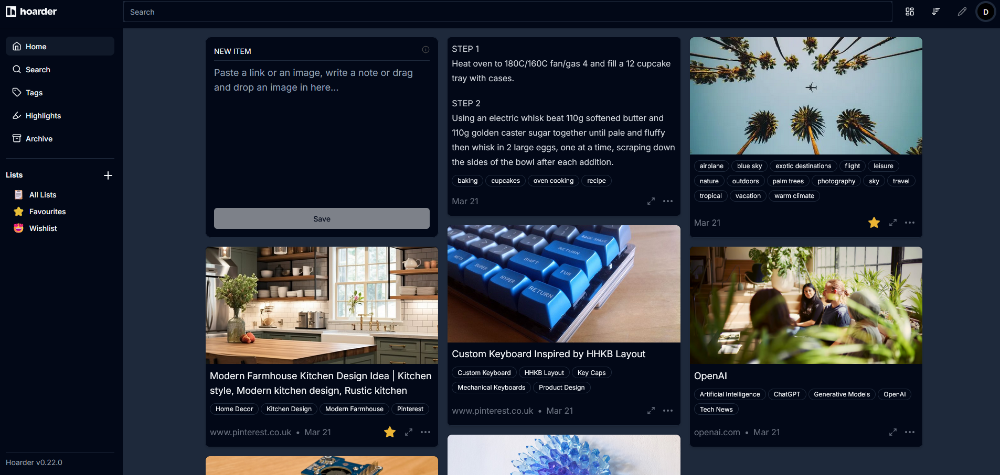
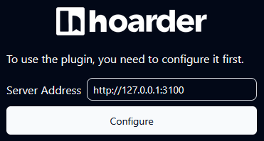

Save websites for later in Hoarder instead of saving them as open tabs in the browser.



## Resources

- [https://hoarder.app/](https://hoarder.app/)
- [https://github.com/hoarder-app/hoarder](https://github.com/hoarder-app/hoarder)

## Prerequisites

In the server root directory, create a folder called `hoarder/`. `cd` into it and create the files `docker-compose.yml` and  `.env`.

## .env

You must create two secrets that will be used in your `.env` file. Run this command (two times) to create a secret:

```bash
openssl rand -base64 36
```

```.env
HOARDER_VERSION=release
NEXTAUTH_SECRET=YourNextauthSecret
MEILI_MASTER_KEY=YourMeiliSecret
NEXTAUTH_URL=http://localhost:3000
```

### Configuration

- **NEXTAUTH_URL** - The URL you will use for logging in. If you change this port you must also change the port under `ports` in the `docker-compose.yml` file.

## Docker Compose

```yaml title="docker-compose.yml" linenums="1"
---
services:
  web:
    image: ghcr.io/hoarder-app/hoarder:${HOARDER_VERSION:-release}
    restart: unless-stopped
    volumes:
      - data:/data
    ports:
      - 3000:3000
    env_file:
      - .env
    environment:
      MEILI_ADDR: http://meilisearch:7700
      BROWSER_WEB_URL: http://chrome:9222
      # OPENAI_API_KEY: ...
      DATA_DIR: /data

  chrome:
    image: gcr.io/zenika-hub/alpine-chrome:123
    restart: unless-stopped
    command:
      - --no-sandbox
      - --disable-gpu
      - --disable-dev-shm-usage
      - --remote-debugging-address=0.0.0.0
      - --remote-debugging-port=9222
      - --hide-scrollbars

  meilisearch:
    image: getmeili/meilisearch:v1.11.1
    restart: unless-stopped
    env_file:
      - .env
    environment:
      MEILI_NO_ANALYTICS: "true"
    volumes:
      - meilisearch:/meili_data

volumes:
  meilisearch:
  data:
```

### Configuration

- **Ports** - Select an avaliable port for the UI. If you change this port, you must also change the port in the `.env` file.
- **OPENAI_API_KEY** - If you have an API key from OpenAI and want to use AI in hoarder, you enter the API key here.

## Portainer

If you are using Portainer, you can not use the `.env` file as intended since it's not loaded when the stack is created.

Add the secrets variables `NEXTAUTH_SECRET` and `MEILI_MASTER_KEY` to the `docker-compose.yml` file and remove them from the `.env` file. Also, remove the variables `env_file` from the two services.

```yaml
services:
  web:
    environment:
      NEXTAUTH_SECRET: YourNextauthSecret

  meilisearch:
    environment:
      MEILI_MASTER_KEY: YourMeiliSecret
```

When creating the stack in Portainer, either import the `.env` file with the two remaining variables by clicking **Load variables from .env file** or enter them manually by clicking **Add an environment variable** .

Note that if you do this, the variables will be visible in the Portainer UI which could be a security risk.

## Deploy the container

Run the Docker Compose file as a stack in Portainer or with:

```bash
docker compose up -d
```

## Login

**UI:** http://server-ip:3000

Create a user account when you log in the first time.

## Browser extension

There are extensions for Google Chrome and Firefox:

- [Google Chrome](https://chromewebstore.google.com/detail/hoarder/kgcjekpmcjjogibpjebkhaanilehneje)
- [Firefox](https://addons.mozilla.org/en-US/firefox/addon/hoarder/)

You must type `http://` before the ip and port for the connection to work.



!!! info "Firefox"
  
    At the moment, the extension is not available for download from the Mozilla add-ons page. Use instead this version and install manually: [Download](https://web.archive.org/web/20241201165104if_/https://addons.mozilla.org/firefox/downloads/file/4357468/hoarder-1.2.3.xpi) ([Github issue](https://github.com/hoarder-app/hoarder/issues/899#issuecomment-2616905901))