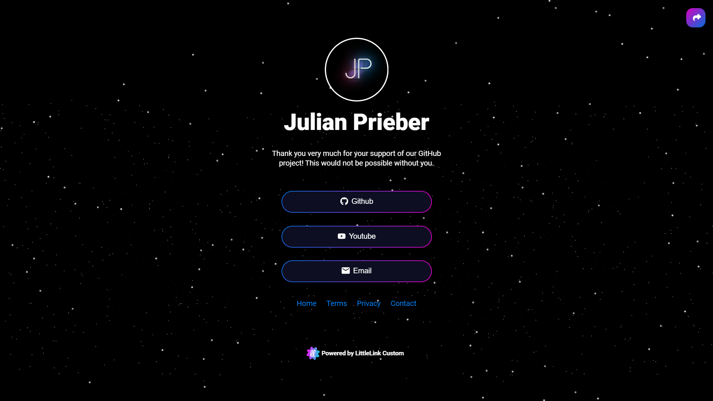

LinkStack is a link sharing platform that is a free and open-source alternative to Linktree.



## Resources

- [LinkStack documentation](https://docs.linkstack.org)

## Prerequisites

In the server root directory, create a folder called `linkstack/`. `cd` into it and create the file `docker-compose.yml`.

## Docker Compose

```yaml title="docker-compose.yml" linenums="1"
---
services:
  linkstack:
    image: linkstackorg/linkstack:latest
    container_name: linkstack
    hostname: linkstack
    restart: unless-stopped
    ports:
      - 80:80
      - 443:443
    environment:
      - HTTP_SERVER_NAME=example.com # Optional
      - HTTPS_SERVER_NAME=example.com # Optional
      - SERVER_ADMIN=email@example.com
      - TZ=Euprope/Stockholm
      - PHP_MEMORY_LIMIT=512M
      - UPLOAD_MAX_FILESIZE=8M
    volumes:
      - htdocs:/htdocs

volumes:
  htdocs:
```

### Configuration

- **Ports** - Select avaliable ports for the UI.
- **Environment**

    - `TZ` - Set your local timezone.
    - `SERVER_ADMIN` - Set the email address for ther server admin.

## Deploy the container

Run the Docker Compose file as a stack in Portainer or with:

```bash
docker compose up -d
```

## Login

**UI:** https://server-ip:443/login

## Setup

Go to the UI and run the setup. 

- Use SQLite as database.
- Create an admin account and make some final settings.

### Themes

Download themes from [https://linkstack.org/themes/](https://linkstack.org/themes/) and upload them via the UI.