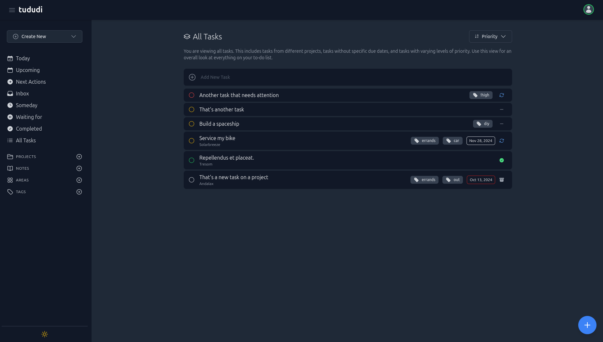

Simple project managgement and todo app. Tududi is a currently a single user only application.



## Resources

- [https://github.com/chrisvel/tududi](https://github.com/chrisvel/tududi)

## Prerequisites

In the server root directory, create a folder called `tududi/`. `cd` into it and create the file `docker-compose.yml`.

## Docker Compose

```yaml title="docker-compose.yml" linenums="1"
---
services:
  tududi:
    image: chrisvel/tududi:latest
    container_name: tududi
    restart: unless-stopped
    ports:
      - 9292:9292
    volumes:
      - db:/usr/src/app/tududi_db
    environment:
      - TUDUDI_INTERNAL_SSL_ENABLED=false
      - TUDUDI_SESSION_SECRET=your_generated_hash_here
      - TUDUDI_USER_PASSWORD=mysecurepassword
      - TUDUDI_USER_EMAIL=myemail@example.com

volumes:
  db:
```

### Configuration

- **Ports** - Select an avaliable port for the UI.
- **Environment**
    - `TUDUDI_INTERNAL_SSL_ENABLED` - Set to `true` if you will use a reverse proxy with an SSL certificate.
    - `TUDUDI_SESSION_SECRET` - Generate a hash using:

        ```bash
        openssl rand -hex 64
        ```

    - `TUDUDI_USER_PASSWORD` - Your login password
    - `TUDUDI_USER_EMAIL` - Your login email

## Nginx Proxy Manager

If you are using Nginx Proxy Manager with a SSL certificate, select scheme `https`.

## Deploy the container

Run the Docker Compose file as a stack in Portainer or with:

```bash
docker compose up -d
```

## Login

**UI:** http://server-ip:9292