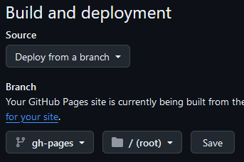

Material for MkDocs is a documentation framework made for MkDocs and is build with Python. It offers a lot of functionallity and customization to you project as well as easy deployment to Docker, GitHub Pages and GitLab Pages.

## Resources

- [Material for MkDocs documentation](https://squidfunk.github.io/mkdocs-material/)

## Prerequisites

You will have to install Mkdocs with its dependencies before you can install Material for MkDocs. Follow this guide to [install MkDocs](mkdocs.md)

## Installation

```bash
pip install mkdocs-material
```

## Docker

If you want to develop or deploy the site using Docker, please follow [these instructions](../docker-containers/material-for-mkdocs.md) on how to do that.

## File structure

The file structure of a MkDocs site will look like this with the `docs/` folder containing all of your site data and in the root you will have your config file `mkdocs.yml`, `README` and `.github/` folder (for workflows).

``` {.sh .no-copy}
my-site/
├─ .github/
│  └─ workflows/
│     └─ ci.yml
├─ docs/
│  ├─ assets/
│  │  ├─ images/
│  │  │  ├─ favicon.ico
│  │  │  └─ logo.svg
│  │  └─ stylesheets/
│  │     └─ custom.css
│  ├─ overrides/
│  │  └─ partials/
│  │     └─ logo.html
│  ├─ CNAME
│  └─ index.md
├─ .gitignore
├─ mkdocs.yml
└─ README.md
```

## Usage

### Create a new project

`cd` in to the folder that you want to use as root, for example `my-site/`. The command below will create the `docs/` folder and `mkdocs.yml` inside that directory. 

```bash
mkdocs new docs
```

``` {.sh .no-copy}
my-site/
├─ docs/
│  └─ index.md
└─ mkdocs.yml
```

The following code is required for the site to work. Add it to `mkdocs.yml`:

```yaml title="mkdocs.yml"
site_name: My Site
theme:
  name: material
```

You can now test your new site by running `mkdocs serve`:

```bash
mkdocs serve
```

Open the local instance on [http://localhost:8000/](http://localhost:8000/).

Refer to the [Material for MkDocs documentation](https://squidfunk.github.io/mkdocs-material/) for setup and usage.

### .gitignore

If you have built your site into html and don't want to push that to your repo, you can add this line to you `.gitignore`:

```title=".gitignore"
/site
```

## Deploy to GitHub Pages

You can deploy Material for MkDocs in a couple of ways, but these instructions will explain how to deploy to GitHub Pages.

### Create the workflow

Create a workflow file that will be executed automatically. The file `ci.yml` must be placed in `/.github/workflows/`.

``` {.sh .no-copy}
my-site/
└─ .github/
   └─ workflows/
      └─ ci.yml
```

Add the following code to `ci.yml`:

```yaml title="ci.yml"
name: ci 
on:
  push:
    branches:
      - master
permissions:
  contents: write
jobs:
  deploy:
    runs-on: ubuntu-latest
    steps:
      - uses: actions/checkout@v4
      - name: Configure Git Credentials
        run: |
          git config user.name github-actions[bot]
          git config user.email 41898282+github-actions[bot]@users.noreply.github.com
      - uses: actions/setup-python@v5
        with:
          python-version: 3.x
      - run: echo "cache_id=$(date --utc '+%V')" >> $GITHUB_ENV 
      - uses: actions/cache@v4
        with:
          key: mkdocs-material-${{ env.cache_id }}
          path: .cache
          restore-keys: |
            mkdocs-material-
      - run: pip install mkdocs-material 
      - run: mkdocs gh-deploy --force
```

If you use plugins they must be installed together with MkDocs. Add them at the bottom of `ci.yml`:

```yaml title="ci.yml"
jobs:
  deploy:
    steps:
      - run: pip install mkdocs-material 
      - run: pip install mkdocs-glightbox
      - run: mkdocs gh-deploy --force
```

### Make a GitHub repository

Depending on how you want to access your website the repository name will differ. Your free GitHub Pages site will always start with the URL `<USERNAME>.github.io` and the site can be put in either that main site or in a subdomain like `<USERNAME>.github.io/docs`.

- If you want to use the **main site**, create a repository called `<USERNAME>.github.io`. The URL to your site will be `https://username.github.io`.

    Clone the repo:

    ```bash
    clone https://github.com/<USERNAME>/<USERNAME>.github.io
    ```

- If you want to use a **subdomain**, create a repository called whatever you like, for example: `docs`. The URL to your site will be `https://username.github.io/docs`.

    Clone the repo:

    ```bash
    clone https://github.com/<USERNAME>/docs
    ```

### Push your code to GitHub

Copy the files from your local development site that you have built and place it in the local repo.

Push your code to GitHub.

```bash
git add .
git commit -m 'Initial commit'
git push
```

Now your site will be built and deployed to GitHub Pages using GitHub Actions. It might take a minute for the site to be accessible after deployment.

Go to the repository **Settings** and **Pages**. Chose to deploy Pages from a branch and select `gh-pages`.



### Custom domain

If you use a custom domain for your GitHup Page, then you must include a `CNAME` file with your project. Otherwise the custom domain setting on GitHub will be overwritten when you deploy your site.

Create a file called `CNAME` (no extension) in your `my-site/docs/` folder with your content.

``` title="CNAME"
example.com
```

This will set the custom domain field every time you run the action workflow when you push a new version of your site.