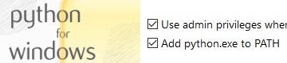

If you want to develop a MkDocs site locally, you need to install some dependencies first: Ruby, Python and Pip. This page will explain how to install these dependencies and then how to install MkDocs. 

!!! tip
	Do not follow the instructions on the MkDocs page! Instead, follow the instructions for installing Jekyll on Windows. The Jekyll site offers an easier way of accomplishing just about the same thing as the MkDocs site.

## Resources

- [MkDocs Documentation](https://www.mkdocs.org/user-guide/installation/)
- [Ruby-Devkit Download](https://rubyinstaller.org/downloads/)
- [Python Download](https://www.python.org/downloads/)

## Prerequisites

Before you can install MkDocs you have to install Ruby+Devkit, Python and Pip.

### Ruby+Devkit

<div class="steps" markdown>

1. Download Ruby+Devkit from [RubyInstaller Downloads](https://rubyinstaller.org/downloads/).
1. Run the installation file and follow the instructions. Use default options.

	!!! warning "Important"
		On the last stage of the installation wizard, run the **ridk install** step. This is needed for installing gems with native extensions. You can find additional information regarding this in the [RubyInstaller Documentation](https://github.com/oneclick/rubyinstaller2#using-the-installer-on-a-target-system).
		
		Select `MSYS2 and MINGW development tool chain`.

1. Open a new command prompt window from the start menu, so that changes to the `PATH` environment variable becomes effective
1. Install Jekyll and Bundler.
	
	```bash
	gem install jekyll bundler
	```

1. Check if Jekyll has been installed properly.

	```bash
	jekyll -v
	```

</div>

!!! info
	You may receive an error when checking if Jekyll has not been installed properly. Reboot your system and run `jekyll -v` again. If the error persists, please open a [RubyInstaller issue](https://github.com/oneclick/rubyinstaller2/issues/new).

### Python and Pip

More instructions on how to install Python and Pip can be found on the [MkDocs documentation site](https://www.MkDocs.org/user-guide/installation/).

Check if Python and Pip is already installed on your system. If they are already installed you can skip to installing MkDocs.

```bash
python --version
```

```bash
pip --version
```


Go to the [Python Download page](https://www.python.org/downloads/) and download the installer.

<div class="steps" markdown>

1. Choose the latest version and click the **Download** link.
1. Scroll down to the **Files** section.
1. Click the **Windows installer (64-bit)** link and the download starts.
1. Run the installer.

	!!! important
		Check the box **Add python.exe to PATH**.
		
		
			
</div>

Pip should come with the installation of Python but you can check this by running `pip --version` and if you get a version number as response, Pip is installed and you can skip to the next secion.

```bash
pip --version
```

## Install MkDocs

Install MkDocs globally:

```bash
pip install mkdocs
```

Check that MkDocs has been installed:

```bash
mkdocs --version
```

While you *can* use "vanilla" MkDocs from this point on, it's much recommended that you install the theme [Material for MkDocs](https://squidfunk.github.io/mkdocs-material/) as this is a really good add-on to MkDocs and will make a much better site and user experience.

See my [Material for MkDocs documentation](../documentation/material-for-mkdocs.md) for instructions on installation and basic configuration.