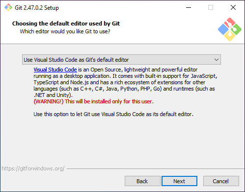
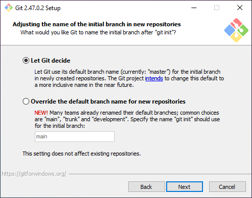

This page will go through some basic commands and applications for Git and use examples for work with GitHub. Git can however be used with multiple different plaforms for hosting your content, like Gitlab and Azure DevOps.

## Prerequites

Create an account on [GitHub](https://github.com) and sign in.

## Cheet sheet

| Command                           | Explanation                         |
| --------------------------------- | ----------------------------------- |
| `git add .`                       | Prepare all files for commit        |
| `git reset`                       | Remove files from commit            |
| `git commit -m "message"`         | Commit the files                    |
| `git branch feature`              | Create a branch named **feature**   |
| `git checkout feature`            | Open the branch **feature**         |
| `git branch -d feature`           | Delete the local branch **feature** |
| `git push -u origin feature`      | Push to remote repo (first time)    |
| `git push`                        | Push to remote repo                 |
| `git config --list`               | List all config settings            |
| `git config user`                 | View user details                   |
| `git config user.name "<NAME>"`   | Set user name                       |
| `git config user.email "<EMAIL>"` | Set user email                      |


Add the option `--global` to `git config` to set or view the global values. If the `--global` option is not selected, the information will only be project specific.

```bash
git config --global user
git config --global user.name "<NAME>"
git config --global user.email "<EMAIL>"
```

## Installation

Check if you have Git installed by running `git -v` in the terminal. Git is already installed if a version is returned.

```bash
git -v
```

### Windows

<div class="steps" markdown>

1. Download Git from the [official website](https://git-scm.com). 

1. Run the .exe file and follow the installation prompts. See some important steps below.

1. Add a Git Bash profile to your terminal (optional).

	

1. Select a default editor.

	

1. Select if you want `master` to be the default branch or if you want something else, like `main`.

	


1. Keep the default settings for the following prompts and finish with **Install**.

</div>

### Linux

*Comming soon...*

## Start a new project

<div class="steps" markdown>

1. Create a new project or repository on GitHub.

1. Open the root folder of your local project in the terminal. You will then create a new Git instance for that project.

	```bash
	git init
	```

	A hidden `.git` folder has now been created in your project that is now treated as a local repository with it's own master branch. The folder contains config files and Git data.

1. Connect the remote repository to your local repository.

	```bash
	git remote add origin https://github.com/<USERNAME>/<REPO_NAME>.git
	```

	Change `<USERNAME>` to your GitHub username and `<REPO_NAME>` to the name of your repository. You can also get the address from GitHub.

	

	If this is the first time you connect to your local repository, you will have to log in to your GitHub account via the window that will appear.

1. Check the status of you project. If you already have files in your project there should be alot of "untracked" files.

	```bash
	git status
	```

	If you don't have any files in your project, create a file called `README.md` in the project root and push that to the repository. If you later want to push your code to a new branch in the repository, you must first push something to the master branch as it can't be empty.

	??? note "Example file"

		```md title="README.md" linenums="1"
		# My project

		This is a README file.
		```

1. Add all of the files to the staging area where they are prepared for the commit.

	```bash
	git add .
	```

1. Commit the code with a short comment that describes what code we are pushing or why.

	```bash
	git commit -m "First commit"
	```

1. You can now push your code to the remote repository on GitHub for example. The command below will push your code to the master branch.

	```bash
	git push -u origin master
	```

	!!! warning "Push to another branch"

		The master branch must have content before you can push to another branch - it can't be empty. As long as the master branch is not empty, you can push like normal:

		```bash
		git push -u origin dev
		```

	After the first push, you don't have to specify the origin:

	```bash
	git push
	```

!!! success "Your code has now been pushed to GitHub"

</div>

## Cloning

To clone a repo, you need the url to the repo:

```bash
git clone <url>
```

```bash
git clone https://github.com/jonasbirkelof/beets-php
```

To clone a specific branch from the project, you add the branch flag:

```bash
git clone <url> -b <branch> --single-branch [<folder>]
```

```bash
git clone https://github.com/jonasbirkelof/beets-php -b dev --single-branch
```

## Branches

Using branches is helpful when you want to edit your code without your main or production being affected before you are done. For example, if you want to create a new feature, you will create a feature branch, push your code to that branch and when you are done you will make a "pull request" and merge your code in the feature branch with the code in your master branch.

These steps will assume that you only have a master branch in your repository.

<div class="steps" markdown>

1. Create a new branch.

	```bash
	git branch feature
	```

1. Checkout the new branch.

	```bash
	git checkout feature
	```

1. Check that you have changed branch.

	```bash
	git branch
	```

	The one with the __* asterisk__ is the one that is checked out.

	To list the remote branches as well, add the `-a` option.

	```bash
	git branch -a
	```

1. Commit your code like usual and then push to the remote repository.

	```bash
	git push -u origin feature
	```

	After the first push, you don't have to specify the origin:

	```bash
	git push
	```

!!! success "Your code has now been pushed to GitHub to the feature branch"

</div>

## Workflows for branches

Learn more about working with branches in this blog post: [Workflows for Git branches](../../blog/posts/workflows-for-git-branches.md)

## Make a pull request

When you are done working on a branch for e.g. a new feature, you will want to merge that code to a branch for an upcomming releas or the master branch. You do this by first making a pull request that will check your new code if there are any conflicts with the existing code and then merge them.

These steps will assume that you have pushed a **feature** branch to GitHub and that you want to merge it with a branch called **1.0.0** that is the branch for an upcomming release that will later be merged with the **master** branch when it is complete.

<div class="steps" markdown>

1. Click on **Compare & pull request** or go to the **Pull requests tab** and create it from there.

	

1. Fill out the form for the pull request.

	!!! warning "Target branch"
		
		Make sure that the **base** branch is set to **1.0.0** and that **compare** is set to **feature**. This will merge the feature branch with the 1.0.0 branch.

		

	- **Title:** The title originates from the commit message but it can be changed to something appropriate. 
		
		If you merge an upcomming version to master, set the title to **Version 1.0.0**.

	- **Description:** Add a description of what your new code will accomplish or what you have fixed.

1. You can review the difference between the new and existing code at the bottom of the page.

1. Click on *Create pull request*.

1. GitHub will now check if there are any conflicts between the new and existing code.

	

1. Add a comment (optional).

1. In the right hand column, you can select **Reviewers**, **Lables** and other options for the commit. Under **Development** you can select an issue if this pull request is related to one.

1. Click on **Merge pull request** when you are done.

1. Now you must name your merge. It can be the same thing as the title for the commit.
	
	!!! warning "Merge number"
		
		Save the number for the merge (i.e. #123) and preferably put it in perentheses for better readability. The number will generate as a link to you merge in the title.

		

	If you merge an upcomming version to master, set the title to **Version 1.0.0 (#123)**.

1. Click on **Confirm merge**.

1. You can now delete the feature branch.

	

1. If you chose to attach an issue to your pull request in the previous step, you can now open the issue and mark it as done. Your pull request should have been added to the issue.

</div>

!!! success "You are now done with your pull request"

## Reset your local environment after a pull request

If you have created a feature branch from the master branch, pushed it to GitHub and then merged it with the master branch, your local master branch will be out of sync with the remote master branch since it does not contain the newly merged code from the feature branch.

To resolve this we need to reset the local environment so that it matches the remote repository.

<div class="steps" markdown>

1. Checkout the master branch in your local project.

	```bash
	git checkout master
	```

1. Pull the master branch from the remote repository.

	```bash
	git pull origin master
	```

1. Reset the local branch

	```bash
	git reset --hard origin/master
	```

	This step will reset the local staging area and rewrite the local branch's history to match the remote branch.

</div>

!!! success "Your local repository is now up to date"

## Make a release

When you push a new version of your code and want to make it easliy available for the community, it is a good idea to make a release. A release bunldes the source code from your repository for that specific time (like a snapshot) along with other files that you want to include, like binary versions of the project for different operating systems. You can also write a changelog so that the users can see what has changed from the previous version.

<div class="steps" markdown>

1. Click on **Create a new release** in the right hand column.

1. Add the information for the release.

	- **Tag:** Create a tag for the new version of your code. The tag can be named **1.0.0** which is the semmantic version number.

		
	
	- **Target:** Select target as **master**. This will add the code that is in the master right now to the release as a zip-file. You can select a different branch if you for instance are making bug fixes for a legacy version that you keep in its own branch.

	- **Title:** Make the title the same as the tag, but you can add a "version" prefix if you like (**Version 1.0.0**).
	
	- **Write:** In the description you can write the information about this release, like the cange log or . 
	
		!!! tip 
		
			If you click on **Generate release notes** at the top of the page, release notes will automatically be added as markdown for you.

			
	
	- Attach addition files that you want include in your release.

1. Click on **Publish release**.

Since you created a tag (1.0.0) for the release, you can now view that tag using the same dropdown as for selecting branches. By selecting the tag you will view a snapshot of your source code from when the release was created, the same source code that was zipped and added to the release, along with its history.


!!! success "You have now made a release"

</div>