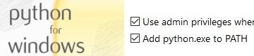

This page will explain how to install Python and Pip.

## Resources

- [Python Download](https://www.python.org/downloads/)

## Installation

Check if Python and Pip is already installed on your system. If they are already installed you can skip to installing MkDocs.

```bash
python --version
```

```bash
pip --version
```

### Windows

Go to the [Python Download page](https://www.python.org/downloads/) and download the installer.

<div class="steps" markdown>

1. Choose the latest version and click the **Download** link.

1. Scroll down to the **Files** section.

1. Click the **Windows installer (64-bit)** link and the download starts.

1. Run the installer.

	!!! important
		Check the box **Add python.exe to PATH**.
		
		

1. Pip should come with the installation of Python but you can check this by running `pip --version` and if you get a version number as response, Pip is installed and you can skip to the next secion.

	```bash
	pip --version
	```
			
</div>

### Linux

*Comming soon...*